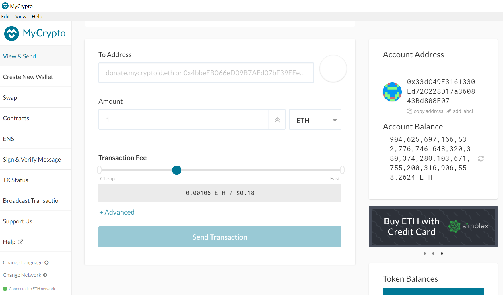

# Building Blockchain
##  Creating Nodes
​
1. Add a empty directory for nodes 

    mkdir node1 node2

2. Get new accounts numbers from nodes to use as signers

    ./geth account new --datadir node1

    ./geth account new --datadir node2

3. Save passwords & Account addresses for use later

    echo 'node1' > node1/password.txt

    echo 'node2' > node2/password.txt

    echo '33dc49e3161330ed72c228d17a360843bd808e07' >> accounts.txt

    echo '9044a304acbf46ac2945cbcca605b4cf9b3f9797' >> accounts.txt

    

##  Puppeth
4. Running puppeth

    ./puppeth

    

    

## Initializing and start mining

5. Initialize nodes

    ./geth init chrizznet.json --datadir node1

    ./geth init chrizznet.json --datadir node2

    

6. Launching nodes

    Node 1

    ./geth.exe --datadir node1/ --mine --minerthreads 1 --unlock '33dc49e3161330ed72c228d17a360843bd808e07' --password node1/password.txt --rpc --allow-insecure-unlock

    

    

    Node 2

    ./geth.exe --datadir node2/ --rpcapi 'personal,db,eth,net,web3,txpool,miner' --bootnodes 'enode://7f6152ab63b411bce2b41940d6191d6befdddc39fd49aadde5070217df593690f4c396ba0ed3654ef37d6e0d375886bbefc32c3f312686ac417c143b12858125@127.0.0.1:30303' --port 30304  --syncmode 'full' --mine --minerthreads 1 --unlock '9044a304acbf46ac2945cbcca605b4cf9b3f9797' --password node2/password.txt --allow-insecure-unlock --ipcdisable

    

## MyCrypto

7. Open MyCrypto & Click on "Add Custom Node", then add the custom network      information that was set in the genesis.

    

8. Import the keystore file from the directory into MyCrypto 

    

    

     
9. Make transaction

    

    

10. Copy the transaction hash and paste it into the "TX Status" section of the app, or click "TX Status" in the popup
    
    TX Hash
    0x0443e34f4e498b984e29c54035150f98aab6ca98076deeb752e4c3a07c3ffb6c

    
